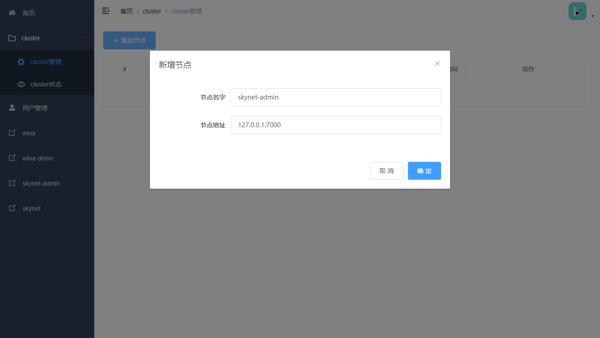
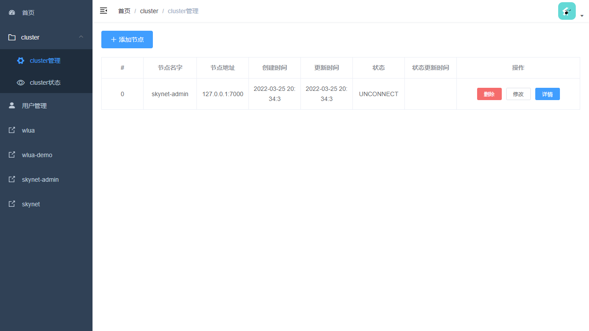
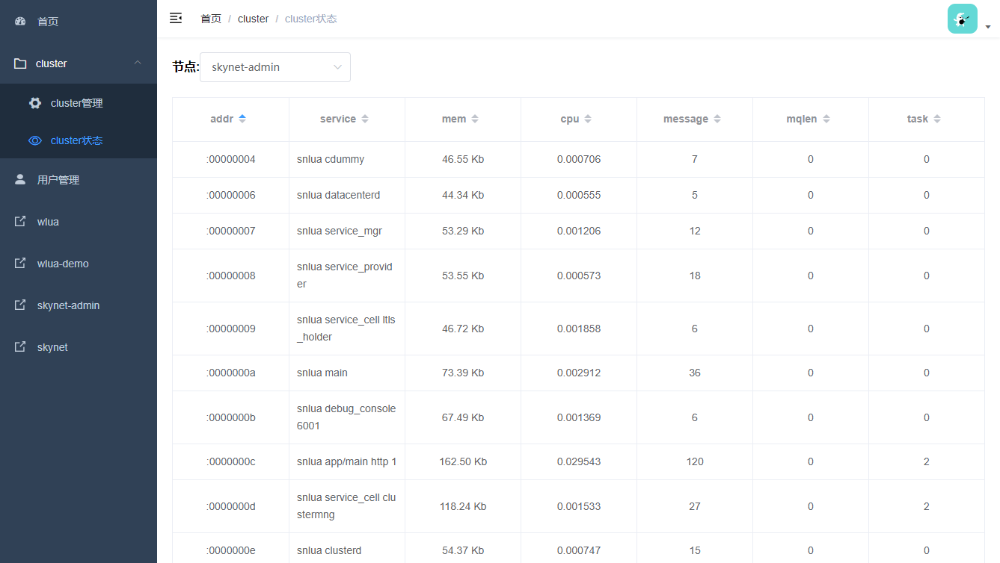

# skynet-admin

skynet 集群管理工具

## 体验

```shell
docker pull hanxi/skynet-admin
docker run -p 2788:2788 -d hanxi/skynet-admin
```

浏览器进入： <http://localhost:2788>

默认用户： `admin`
默认密码： `admin`

## 功能

- 查看节点状态信息
- 基于 [wlua](https://github.com/hanxi/wlua) , 使用 cluster 协议管理节点
- 无需修改原有 skyent 节点代码，采用远程注入的方式操控节点（**依赖 service/service_provider.lua 的 close 接口，需要最新的 skynet 版本**）
- 方便自定义其他功能，比如向节点远程执行代码

## 后台接口文档

<http://home.hanxi.cc:2009/web/#/6/24>

## 截图

增加节点



查看节点列表



查看节点详情



